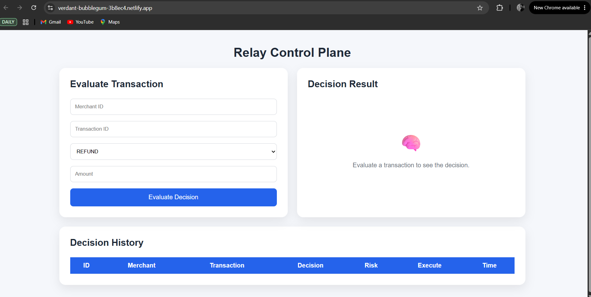
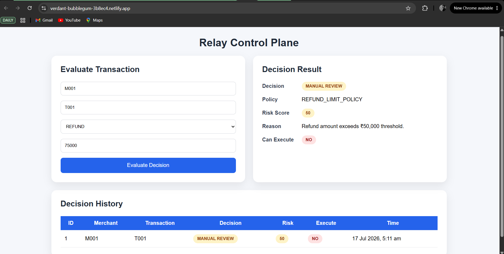
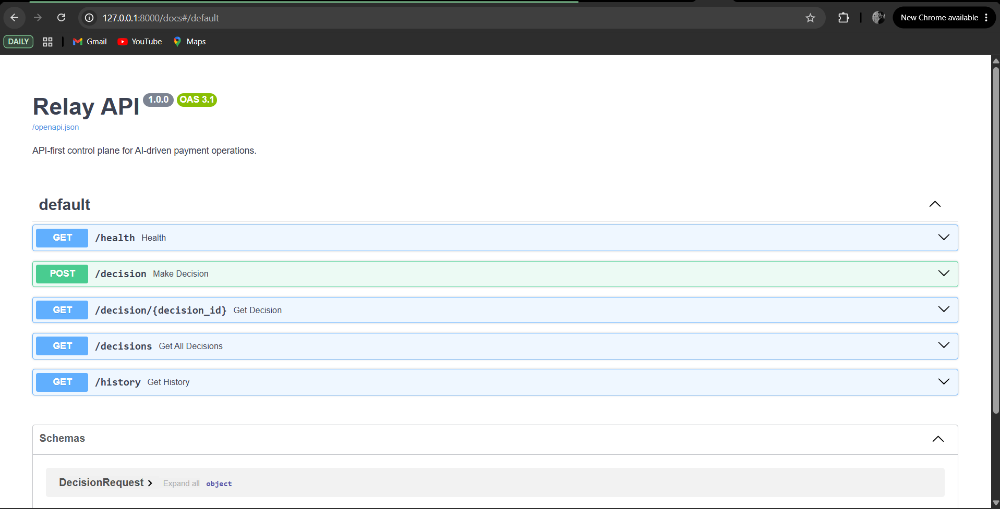

# 🚀 Relay Control Plane

A full-stack payment decision engine built with **FastAPI** and **React**.

Relay evaluates payment requests against configurable business policies and risk rules, helping automate operational decisions such as refunds while ensuring compliance with business thresholds.

---

# 🎯 What Relay Does

Relay simulates a payment operations control plane by evaluating refund requests against configurable business policies.

For every request, the system:

- ✅ Validates the transaction
- 📋 Applies configurable business policies
- ⚠️ Calculates a risk score
- 🤖 Determines whether the request should be approved or manually reviewed
- 📝 Stores every decision for future auditing and analysis

---

# 🌐 Live Links

### 🚀 Live Application

👉 https://verdant-bubblegum-3b8ec4.netlify.app/

### 📖 Interactive API Documentation

👉 https://relay-api-8e8n.onrender.com/docs

### 💻 GitHub Repository

👉 https://github.com/dishank-agarwal/Relay

---

# ✨ Features

- 🔍 Evaluate payment decisions in real time
- 📋 Policy-based decision engine
- ⚠️ Dynamic risk scoring
- 📜 Decision history with audit trail
- 🌐 RESTful API built with FastAPI
- 📚 Interactive Swagger API documentation
- 💻 Responsive React frontend
- ☁️ Cloud deployment using Render and Netlify

---

# 🛠️ Tech Stack

| Category | Technologies |
|----------|--------------|
| **Frontend** | React, Vite, Axios, CSS |
| **Backend** | FastAPI, SQLAlchemy, Pydantic |
| **Database** | SQLite |
| **Deployment** | Netlify, Render |
| **Version Control** | Git, GitHub |

---

# 🏗️ System Architecture

```text
                 Browser
                    │
                    ▼
            Netlify (React UI)
                    │
               HTTPS Requests
                    │
                    ▼
          Render (FastAPI Backend)
                    │
             Policy Evaluation
                    │
                    ▼
             SQLite Database
```

---

# 📸 Screenshots

## Home Page



---

## Decision Result



---

## API Documentation



---

# 📡 API Endpoints

| Method | Endpoint | Description |
|---------|----------|-------------|
| GET | `/health` | Health check |
| POST | `/decision` | Evaluate a payment decision |
| GET | `/decisions` | Retrieve decision history |

Interactive API documentation:

👉 https://relay-api-8e8n.onrender.com/docs

---

# 📦 Example API Response

```json
{
  "decision": "MANUAL_REVIEW",
  "policy": "REFUND_LIMIT_POLICY",
  "risk_score": 50,
  "reason": "Refund amount exceeds ₹50,000 threshold.",
  "can_execute": false
}
```

---

# 🚀 Running Locally

## Clone the repository

```bash
git clone https://github.com/dishank-agarwal/Relay.git
cd Relay
```

## Backend

```bash
python -m venv .venv

# Windows
.venv\Scripts\activate

pip install -r requirements.txt

uvicorn app.main:app --reload
```

Backend runs at:

```
http://localhost:8000
```

---

## Frontend

```bash
cd frontend

npm install

npm run dev
```

Frontend runs at:

```
http://localhost:5173
```

---

# 🔮 Future Improvements

- 🔐 JWT Authentication
- 👥 Merchant Management
- ⚙️ Dynamic Policy Management UI
- 🐘 PostgreSQL Integration
- 🐳 Docker Support
- 📊 Analytics Dashboard
- 🧪 Unit & Integration Tests
- 🚀 CI/CD using GitHub Actions

---

# 📚 Key Learnings

This project helped me gain practical experience with:

- Building REST APIs using FastAPI
- Designing a layered backend architecture
- Using SQLAlchemy ORM for database operations
- Building responsive user interfaces with React
- Connecting frontend and backend using REST APIs
- Deploying full-stack applications on Netlify and Render
- Debugging CORS and production deployment issues
- Managing projects using Git and GitHub

---

# 👤 About the Developer

**Dishank Agarwal**

- GitHub: https://github.com/dishank-agarwal
- LinkedIn: http://linkedin.com/in/dishank-agarwal

---

# 📄 License

This project is licensed under the MIT License.